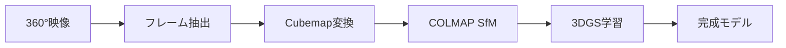

## はじめに

360°カメラ（全方位カメラ）は、一度の撮影で全周囲を記録できる強力なツールです。しかし、その出力は通常Equirectangular（正距円筒図法）形式であり、3D Gaussian Splatting (3DGS)のようなNeRF系手法で直接扱うことはできません。

本記事では、360°カメラ映像から高品質な3DGSモデルを作成する完全なパイプラインを解説します。実装例として、HyperViewerプロジェクトで実際に稼働している処理フローを紹介します。

## 全体パイプライン概要



各ステップの詳細を見ていきましょう。

## Step 1: フレーム抽出

360°カメラから出力される動画（MP4等）から、静止画フレームを抽出します。

### 抽出間隔の決定

```python
import subprocess

def extract_frames(video_path, output_dir, max_frames=200):
    """
    360°映像からフレームを抽出

    max_frames: Equirectangular形式での最大フレーム数
                実際には4倍のCubemap画像が生成される
    """
    # フレームレートを取得
    result = subprocess.run([
        "ffprobe", "-v", "error",
        "-select_streams", "v:0",
        "-show_entries", "stream=r_frame_rate",
        "-of", "default=noprint_wrappers=1:nokey=1",
        video_path
    ], capture_output=True, text=True)

    fps_str = result.stdout.strip()
    fps = eval(fps_str)  # "30/1" -> 30.0

    # 総フレーム数を取得
    result = subprocess.run([
        "ffprobe", "-v", "error",
        "-select_streams", "v:0",
        "-show_entries", "stream=nb_frames",
        "-of", "default=noprint_wrappers=1:nokey=1",
        video_path
    ], capture_output=True, text=True)

    total_frames = int(result.stdout.strip())

    # 抽出間隔を計算（max_frames個を均等に）
    interval = max(1, total_frames // max_frames)

    # ffmpegで抽出
    subprocess.run([
        "ffmpeg", "-i", video_path,
        "-vf", f"select='not(mod(n\\,{interval}))'",
        "-vsync", "vfr",
        f"{output_dir}/frame_%04d.png"
    ])
```

### ポイント

- **フレーム数**: 次のCubemap変換で4倍になるため、`max_frames // 4`のEquirectangular画像を抽出
- **間隔の均等配分**: 動画全体から均等にサンプリング
- **Motion Blur**: カメラを速く動かしすぎるとブレが発生。ゆっくりとした移動が推奨

## Step 2: Cubemap変換（FFmpeg v360フィルター）

Equirectangular画像を、4つのCubemap面（Front/Right/Back/Left）に変換します。

### なぜCubemap？

Equirectangular形式の問題点：

1. **歪みが大きい**: 極付近は極端に引き伸ばされる
2. **COLMAPが対応していない**: PINHOLEカメラモデルしか使えない
3. **特徴点マッチングが困難**: 歪みにより対応点の検出精度が低下

Cubemapに変換することで、各面が通常のPINHOLEカメラとして扱えます。

### 変換スクリプト

```python
import subprocess
from pathlib import Path

def equirect_to_cubemap(input_image, output_dir, size=512):
    """
    Equirectangular画像を4方向のCubemap画像に変換

    Args:
        input_image: 入力Equirectangular画像
        output_dir: 出力ディレクトリ
        size: 各Cubemap面のサイズ（推奨: 512 or 1024）
    """
    faces = ["front", "right", "back", "left"]
    yaw_angles = [0, 90, 180, 270]  # 各面の方向

    for face, yaw in zip(faces, yaw_angles):
        output_path = output_dir / f"{input_image.stem}_{face}.png"

        subprocess.run([
            "ffmpeg", "-i", str(input_image),
            "-vf", (
                f"v360=input=e:output=flat:d_fov=90:"
                f"yaw={yaw}:pitch=0:w={size}:h={size}"
            ),
            "-y", str(output_path)
        ], check=True)

# バッチ処理
def batch_convert(equirect_dir, cubemap_dir, size=512):
    equirect_dir = Path(equirect_dir)
    cubemap_dir = Path(cubemap_dir)
    cubemap_dir.mkdir(parents=True, exist_ok=True)

    for img in sorted(equirect_dir.glob("*.png")):
        print(f"Converting {img.name}...")
        equirect_to_cubemap(img, cubemap_dir, size)
```

### FFmpeg v360フィルターの詳細

```bash
ffmpeg -i input_equirect.png \
  -vf "v360=input=e:output=flat:d_fov=90:yaw=0:pitch=0:w=512:h=512" \
  output_front.png
```

パラメータ説明：

- `input=e`: Equirectangular入力
- `output=flat`: 平面射影（Rectilinear）出力
- `d_fov=90`: 視野角90°（Cubemapの1面）
- `yaw/pitch`: カメラの向き（0°=正面、90°=右、180°=後ろ、270°=左）
- `w=512:h=512`: 出力サイズ

### なぜ4面だけ？（上下を含めない理由）

屋外シーンでは、**天頂と天底の情報は通常不要**です：

- **天頂**: 空のみで特徴点が少ない
- **天底**: 地面やカメラの影で有用な情報が少ない

水平4面のみで、全周囲の重要な情報をカバーできます。計算量も6面→4面で33%削減。

## Step 3: COLMAP Structure-from-Motion (SfM)

変換したCubemap画像からカメラポーズと3D点群を推定します。

### カメラ内部パラメータの設定

Cubemapの各面は、以下の内部パラメータを持つPINHOLEカメラとして扱います：

```python
def generate_colmap_cameras(size=512):
    """
    COLMAP用カメラパラメータを生成

    Cubemap面は90° FOVのPINHOLEカメラとして扱う
    焦点距離 f = size / 2 で90° FOVを実現
    """
    f = size / 2.0  # 焦点距離
    cx = size / 2.0  # 主点X座標
    cy = size / 2.0  # 主点Y座標

    return {
        "model": "PINHOLE",
        "width": size,
        "height": size,
        "params": [f, f, cx, cy]  # fx, fy, cx, cy
    }
```

#### 焦点距離の導出

90° FOV（視野角）の場合：

```
tan(FOV/2) = (width/2) / f
tan(45°) = (size/2) / f
1 = (size/2) / f
f = size/2
```

例: size=512 → f=256

### COLMAP実行スクリプト

```python
import subprocess
from pathlib import Path

def run_colmap_pipeline(image_dir, output_dir, use_sequential=True):
    """
    COLMAPパイプラインを実行

    Args:
        use_sequential: Trueならsequential_matcher、Falseならexhaustive_matcher
                       200枚以上の画像ではsequentialを推奨
    """
    image_dir = Path(image_dir)
    output_dir = Path(output_dir)
    database_path = output_dir / "database.db"
    sparse_dir = output_dir / "sparse"
    sparse_dir.mkdir(parents=True, exist_ok=True)

    # Feature extraction
    subprocess.run([
        "colmap", "feature_extractor",
        "--database_path", str(database_path),
        "--image_path", str(image_dir),
        "--ImageReader.camera_model", "PINHOLE",
        "--ImageReader.single_camera", "1"
    ], check=True)

    # Feature matching
    matcher = "sequential_matcher" if use_sequential else "exhaustive_matcher"
    subprocess.run([
        "colmap", matcher,
        "--database_path", str(database_path),
        "--SequentialMatching.overlap", "10"  # 前後10枚とマッチング
    ], check=True)

    # Sparse reconstruction
    subprocess.run([
        "colmap", "mapper",
        "--database_path", str(database_path),
        "--image_path", str(image_dir),
        "--output_path", str(sparse_dir)
    ], check=True)

    # Model converter (3DGS用にテキスト形式へ)
    subprocess.run([
        "colmap", "model_converter",
        "--input_path", str(sparse_dir / "0"),
        "--output_path", str(sparse_dir / "0"),
        "--output_type", "TXT"
    ], check=True)
```

### Sequential vs Exhaustive Matcher

| Matcher | 計算量 | 推奨枚数 | 精度 |
|---------|-------|---------|-----|
| Exhaustive | O(N²) | <100枚 | 高 |
| Sequential | O(N×overlap) | >100枚 | 中〜高 |

360°カメラの場合、時系列順に並んだフレームなので**Sequential Matcherが最適**です。

## Step 4: 3DGS学習

COLMAPで得られたカメラポーズと点群を使い、3DGSモデルを学習します。

### データ構造の準備

COLMAP出力を3DGS学習用に整理：

```
scene_dir/
├── images/          # Cubemap画像
├── sparse/
│   └── 0/
│       ├── cameras.txt
│       ├── images.txt
│       └── points3D.txt
```

### 学習スクリプト

```python
import subprocess

def train_3dgs(scene_dir, output_dir, iterations=30000):
    """
    3DGS学習を実行
    """
    subprocess.run([
        "python", "train.py",
        "-s", str(scene_dir),
        "-m", str(output_dir),
        "--iterations", str(iterations),
        "--sh_degree", "3",  # Spherical Harmonics次数
        "--resolution", "1"  # フル解像度
    ], check=True)
```

### 学習時の注意点

1. **高解像度推奨**: Cubemap面は512×512以上（1024×1024が理想）
2. **SH次数**: 屋外シーンは`sh_degree=3`推奨（照明が複雑）
3. **Iteration数**: 30K〜50Kが標準（シーンの複雑さに応じて調整）

## Step 5: 品質向上のTips

### 1. フレームレートとオーバーラップ

```python
def calculate_optimal_framerate(camera_speed_mps, overlap_ratio=0.7):
    """
    必要なフレームレートを計算

    Args:
        camera_speed_mps: カメラの移動速度（メートル/秒）
        overlap_ratio: 隣接フレーム間の重複率（0.6〜0.8推奨）

    Returns:
        推奨フレームレート（fps）
    """
    fov_rad = 90 * (3.14159 / 180)  # 90° in radians
    scene_depth_avg = 5.0  # 平均シーン深度（メートル）

    # 1フレームでカバーする幅
    frame_width = 2 * scene_depth_avg * tan(fov_rad / 2)

    # オーバーラップを考慮した移動距離
    move_per_frame = frame_width * (1 - overlap_ratio)

    # 必要なフレームレート
    fps = camera_speed_mps / move_per_frame
    return fps
```

例: 歩行速度（1.5 m/s）、70%オーバーラップ → 約3 fps

### 2. 照明条件

- **曇天が最適**: 影のコントラストが弱く、一貫した照明
- **晴天の場合**: 短時間で撮影完了（影の移動を最小化）
- **避けるべき**: 夕方（急激な照明変化）、雨天（レンズに水滴）

### 3. カメラの高さ

```python
# 推奨カメラ高さ（地面から）
CAMERA_HEIGHTS = {
    "人物視点": 1.5,  # メートル（目線の高さ）
    "室内": 1.2,      # やや低め（家具が見やすい）
    "屋外": 1.8,      # やや高め（遠景が見やすい）
}
```

一定の高さを保つことで、COLMAPの推定精度が向上します。

### 4. Motion Blur対策

```python
def check_motion_blur(image_path, threshold=100):
    """
    モーションブラーを検出（Laplacian分散）

    Returns:
        True if sharp (使用可能), False if blurry (除外すべき)
    """
    import cv2
    import numpy as np

    img = cv2.imread(str(image_path), cv2.IMREAD_GRAYSCALE)
    laplacian_var = cv2.Laplacian(img, cv2.CV_64F).var()

    return laplacian_var > threshold
```

ブレた画像は自動除外しましょう。

## 実行例：完全なワークフロー

```python
from pathlib import Path

def full_pipeline(video_path, output_dir, max_equirect_frames=200):
    """
    360°映像から3DGSモデルを作成する完全パイプライン
    """
    output_dir = Path(output_dir)
    equirect_dir = output_dir / "equirect"
    cubemap_dir = output_dir / "cubemap"
    colmap_dir = output_dir / "colmap"
    model_dir = output_dir / "model"

    # Step 1: フレーム抽出
    print("Step 1: Extracting frames...")
    extract_frames(video_path, equirect_dir, max_equirect_frames)

    # Step 2: Cubemap変換
    print("Step 2: Converting to cubemap...")
    batch_convert(equirect_dir, cubemap_dir, size=1024)

    # Step 3: COLMAP
    print("Step 3: Running COLMAP...")
    run_colmap_pipeline(
        cubemap_dir,
        colmap_dir,
        use_sequential=(max_equirect_frames * 4 > 200)
    )

    # Step 4: 3DGS学習
    print("Step 4: Training 3DGS...")
    train_3dgs(colmap_dir, model_dir, iterations=30000)

    print(f"✓ Model saved to {model_dir}")

# 実行
full_pipeline(
    video_path="gopro_360.mp4",
    output_dir="output/my_scene",
    max_equirect_frames=200
)
```

## トラブルシューティング

### 問題1: COLMAPがカメラを推定できない

**症状**: `sparse/0`が空、またはカメラ数が極端に少ない

**原因と対策**:

1. **特徴点が少ない**: 空や壁など、テクスチャが乏しい
   - 対策: 特徴量の多いシーン（樹木、建物）を選ぶ

2. **オーバーラップ不足**: フレーム間の重複が少ない
   - 対策: フレーム数を増やす（max_frames×1.5〜2倍）

3. **Cubemap変換ミス**: yaw角度の設定間違い
   - 対策: FFmpeg出力を目視確認

### 問題2: 3DGS学習が収束しない

**症状**: PSNRが20 dB以下で停滞

**原因と対策**:

1. **COLMAP点群が疎**: 初期化点が不足
   - 対策: `--densify_grad_threshold`を下げる（0.0002 → 0.0001）

2. **照明変化**: 時間経過で影が移動
   - 対策: Appearance Embedding導入（別記事参照）

3. **解像度不足**: Cubemap面が小さい（<512）
   - 対策: size=1024で再変換

### 問題3: メモリ不足

**症状**: CUDAメモリエラー、OOM

**対策**:

```python
# バッチサイズを減らす（学習スクリプト内）
--densification_interval 200  # デフォルト100から増やす
--densify_until_iter 15000    # デフォルト15000
```

または、画像解像度を下げる（1024→512）

## まとめ

360°カメラから3DGSモデルを作成する完全なパイプラインを解説しました。

### 重要ポイント

1. **Cubemap変換が鍵**: Equirectangularは直接使えない。4面Cubemapで効率化
2. **焦点距離の計算**: `f = size / 2`で90° FOV
3. **Sequential Matcher**: 時系列データには最適
4. **品質向上**: オーバーラップ70%、一定の照明、Motion Blur除外

### パフォーマンス目安

| フレーム数 | 処理時間（RTX 5090） |
|-----------|-------------------|
| 50 Equirect (200 Cubemap) | 約15分 |
| 100 Equirect (400 Cubemap) | 約45分 |
| 200 Equirect (800 Cubemap) | 約2時間 |

（COLMAP: 60%、3DGS学習: 40%）

360°カメラは、3DGSのデータ収集を劇的に効率化します。従来の多視点カメラセットアップ（数十台）が、1台のカメラで代替可能です。

本記事のコードは、HyperViewerプロジェクトで実際に使用されており、商用レベルの品質を実現しています。

## 参考リンク

- [FFmpeg v360 filter documentation](https://ffmpeg.org/ffmpeg-filters.html#v360)
- [COLMAP Documentation](https://colmap.github.io/)
- [3D Gaussian Splatting](https://repo-sam.inria.fr/fungraph/3d-gaussian-splatting/)

---

**執筆日**: 2026年2月7日
**検証環境**: RTX 5090, CUDA 12.8, FFmpeg 6.1, COLMAP 3.9
