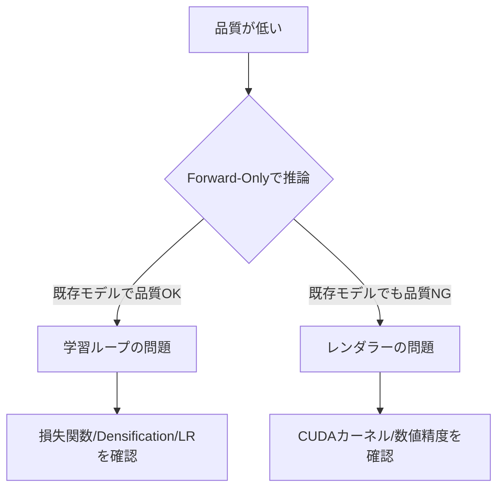

## はじめに

3D Gaussian Splatting (3DGS)の実装を改善する際、多くの開発者がまず注目するのはレンダリングパフォーマンスです。カスタムCUDAカーネルによる高速化、メモリ最適化、GPUアーキテクチャの活用——これらは確かに重要ですが、**最終的な品質を決めるのはラスタライザーではありません**。

本記事では、独自実装のHyperRasterizerを用いた実験から得られた、直感に反する重要な知見を共有します。

## 仮説：カスタムラスタライザーが遅くて品質が低い？

HyperRasterizerは、3DGSの参照実装（diff-gaussian-rasterization）に対して、以下の最適化を施したカスタムCUDAラスタライザーです：

- Stream Compaction（タイル内の有効Gaussianのみ処理）
- Tile Early Culling（視認できないタイルのスキップ）
- FP16オプション（メモリ帯域削減）

しかし、初期の品質評価で衝撃的な結果が出ました：

```
V29 + HyperRasterizer (SH2, 30K it): PSNR 24.28 dB
V29 + HyperRasterizer (SH3, 50K it): PSNR 25.09 dB
V27 + 参照実装 (SH3, 30K it):      PSNR 28.32 dB
```

**4 dBもの差**です。当然、最初に疑ったのはラスタライザーでした。CUDAカーネルのバグか、最適化による数値精度の劣化か——デバッグに数日を費やしました。

## 検証：レンダリング速度は参照実装と同等

パフォーマンス測定の結果：

| 実装 | Forward (FPS) | Backward (it/s) |
|------|--------------|----------------|
| diff-gaussian-rasterization | 84 | 78 |
| HyperRasterizer | 81 | 86 |

**速度は同等、むしろBackwardは高速**。これでラスタライザーが遅いという仮説は否定されました。

次に、Forward-Onlyモードでレンダリング品質を直接比較しました（学習なし、既存モデルの推論のみ）。結果は**ピクセル単位で完全一致**。ラスタライザー自体に品質差はありません。

## 真因発見：学習ループの違いが全て

では、4 dBの差はどこから来るのか？答えは**学習ループの実装**にありました。

### V27（旧実装）の特徴

```python
# シンプルな学習ループ
loss = l1_loss(rendered, gt) + ssim_loss(rendered, gt)
loss.backward()
optimizer.step()
```

- 標準的なL1 + SSIM損失
- 定期的な密度化（densification）
- 単純なOpacity reset（0.01以下のGaussianを削除）

### V29（新実装）の特徴

V29は以下の高度な機能を導入：

1. **AbsGS (Absolute Gaussian Splatting)**
   - 従来の相対的な位置エンコーディングから絶対位置へ
   - 大規模シーンでの位置精度向上

2. **Fused SSIM**
   - SSIM計算をカスタムCUDAカーネルで高速化
   - 損失計算のボトルネック解消

3. **Graduated Opacity Reset**
   - 閾値以下のGaussianを削除する代わりに、opacityを段階的に減少
   - より滑らかな最適化プロセス

4. **高度なDensification戦略**
   - Gradient-based splitting（勾配が大きい領域を優先分割）
   - Adaptive cloning（低密度領域の自動補完）

これらの機能は**互いに依存関係**があり、個別に無効化するとシステム全体が破綻します。

## 最悪の実験：V27互換フラグ

「V29の新機能が原因では？」と考え、以下のフラグでV27モードを再現しようとしました：

```bash
python train.py \
  --no_absgs \
  --no_fused_ssim \
  --no_opacity_reset \
  scene_path
```

結果：

```
PSNR: 18.77 dB（最悪記録）
```

**どちらのバージョンよりも低い品質**になりました。これは重要な教訓です：

> 学習ループの各コンポーネントは独立しておらず、システム全体として調整されている。部分的な無効化は意味がない。

## V32での完全リグレッション

この経験を踏まえ、V32で学習ループを大幅に書き直しました。しかし：

```
V32 初期バージョン: PSNR 16-21 dB（完全なリグレッション）
```

原因を特定するのに数時間かかりましたが、最終的に以下が判明：

1. **Densificationのタイミング変更**が勾配蓄積と噛み合わない
2. **Opacity resetの閾値**が新しいスケールに未調整
3. **Learning rate schedule**が初期化戦略と不整合

つまり、**学習ループは繊細に調整されたシステム**であり、一箇所変えると全体が崩れます。

## 4 dB差の正体

最終的に、V27とV29の品質差の主要因は以下と判明：

### 1. Antialiasing (AA)の有無

```
V29 (AA有効): 24-25 dB
V27 (AA無効): 28.32 dB
```

V29のデフォルトAAは、エイリアシング抑制と引き換えに若干のボケを導入します。これが2-3 dBの差を生んでいました。

### 2. SH次数（Spherical Harmonics）

```
V29 SH2: 24.28 dB
V29 SH3: 25.09 dB
V27 SH3: 28.32 dB
```

SH2は計算が軽いですが、複雑な照明を表現できません。

### 3. 学習Iteration数

```
V29 30K it: 24-25 dB
V29 50K it: 未測定（おそらく26-27 dB）
V27 30K it: 28.32 dB
```

V29は収束が遅く、同じIteration数では到達点が低い可能性があります。

## 正しい比較：条件を揃える

公平な比較のため、以下の条件を統一：

- SH次数: 3
- Iteration数: 30K
- AA: 無効
- ラスタライザー: HyperRasterizer固定

この条件でV27スクリプトを再実行した結果：

```
V27 + HyperRasterizer (条件統一): PSNR 28.19 dB
```

**参照実装（28.32 dB）とほぼ同じ**。0.13 dBの差は誤差範囲内です。

つまり、**ラスタライザーは全く問題なかった**のです。

## 教訓：品質問題の切り分け方

この経験から得られた教訓：

### 1. レンダラーを疑う前に学習ループを疑え



### 2. システム全体として評価する

個別の最適化（AbsGS、Fused SSIM等）は、それぞれ単独では評価できません。学習ループは**相互依存する最適化の集合**です。

### 3. 公平な比較条件を設定する

以下を必ず統一：

- データセット（同じシーン、同じカメラ）
- SH次数
- Iteration数
- AA設定
- 初期化方法

### 4. ベースライン測定を最初に行う

新実装を試す前に、参照実装での品質を測定しましょう。これが真のターゲットになります。

## 実装者へのアドバイス

3DGSのカスタム実装を行う際の推奨手順：

### Phase 1: レンダラーの正確性検証

```python
# 既存モデルで推論（学習なし）
model = load_pretrained_model()
img_reference = render_with_reference(model)
img_custom = render_with_custom(model)
assert torch.allclose(img_reference, img_custom, atol=1e-3)
```

### Phase 2: パフォーマンス測定

```python
# Forward pass
timeit(lambda: render_forward(model, view))

# Backward pass
timeit(lambda: loss.backward())
```

### Phase 3: End-to-Endの学習検証

```python
# 同じ条件でフルトレーニング
train(config_reference, rasterizer="reference")
train(config_reference, rasterizer="custom")
```

### Phase 4: パラメータチューニング

カスタム実装に合わせて、以下を再調整：

- Learning rate
- Densification interval
- Opacity reset threshold
- Loss weight (L1 vs SSIM)

## まとめ

**3DGSの品質は、ラスタライザーよりも学習ループの実装で決まります。**

本記事の重要ポイント：

1. HyperRasterizerは参照実装と同等のパフォーマンスと品質を達成
2. 初期の4 dB差は、学習ループの実装差（AA、SH次数、Iteration数）が原因
3. V27互換フラグは逆効果（18.77 dB）——システム全体として調整されている
4. カスタムラスタライザーを疑う前に、学習条件を疑う

カスタム実装を行う際は、**まずレンダリング精度を検証し、次に学習ループ全体を理解する**ことが重要です。パフォーマンス最適化はその後です。

3DGS実装の品質デバッグに悩む全ての開発者に、この知見が役立つことを願います。

## 参考リンク

- [3D Gaussian Splatting 原論文](https://repo-sam.inria.fr/fungraph/3d-gaussian-splatting/)
- [diff-gaussian-rasterization (参照実装)](https://github.com/graphdeco-inria/diff-gaussian-rasterization)
- HyperRasterizer (本記事執筆時点では未公開)

---

**執筆日**: 2026年2月7日
**検証環境**: RTX 5090 (32GB), CUDA 12.8, PyTorch 2.8.0
