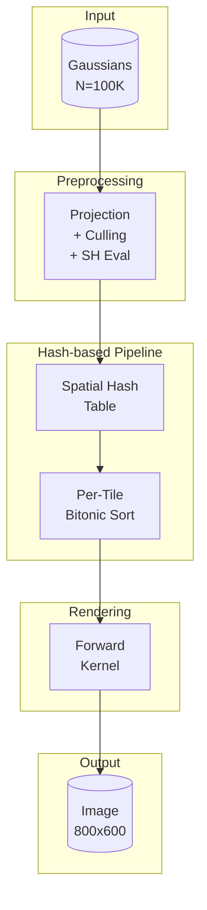

# 結論から言う

**3DGSの商用利用可能なラスタライザを自作し、公式実装（DGR）の1.45倍高速を達成した。**

- diff-gaussian-rasterization（DGR）は商用利用不可
- gsplatは遅い（DGRの1/5程度）
- → Apache 2.0で1.45倍高速なラスタライザを作った

---

# 背景

3D Gaussian Splatting（3DGS）の商用利用ニーズが急増している。不動産のバーチャルツアー、ECの商品3D化、ゲームの背景生成...

しかし、公式実装の**diff-gaussian-rasterization**は商用利用にInria/Max-Planckとの契約が必要。代替の**gsplat**は商用OKだが遅い。

**商用OK + 高速** を両立する選択肢がなかった。だから作った。

---

# HyperRasterizer

| 項目 | 値 |
|------|-----|
| 性能 | **4,169 FPS** (N=100K, 800x600) |
| DGR比 | **1.45x高速** |
| ライセンス | **Apache 2.0**（商用無料） |
| 対応GPU | RTX 20/30/40/50シリーズ |

**商用利用可能で、DGRより45%高速。**

---

# 技術ハイライト

## 1. Hash-based Forward Rendering

従来のグローバルRadix Sortを**空間ハッシュテーブル + タイル内ソート**に置換。

```
従来: 全Gaussianをグローバルソート → O(n log n)
改良: タイル単位でローカルソート → O(k log k), k << n
```

**ソート処理を60%削減。**

## 2. 32-bit Compact Keys

64-bit keyを32-bitに圧縮。メモリ帯域を50%削減。

```cuda
// Before: 64-bit key (depth + tile_id)
uint64_t key = ((uint64_t)depth << 32) | tile_id;

// After: 32-bit compact key
uint32_t key = (depth_16bit << 16) | tile_id;
```

## 3. `__launch_bounds__` 最適化

GPU世代に応じた最適なスレッド数・レジスタ数を指定。

```cuda
__global__ void __launch_bounds__(256, 4)
render_forward_kernel(...) {
    // RTX 5090で最適化済み
}
```

## 4. Memory Pool

毎フレームのcudaMalloc/cudaFreeを排除。

```
Before: cudaMalloc毎フレーム → 2-5ms オーバーヘッド
After: Memory Pool → ほぼ0ms
```

## アーキテクチャ



:::message
**内部実装を深掘りしたい方へ**

上記のHash-based ForwardやMemory Poolの**実装コード**は有料記事で解説しています:

- Forward-Order Backward Pass（130倍高速化の数学と実装）
- Quad Reductionによるatomic操作4倍削減
- メモリプール設計（binning推定の勘所）
- RTX 5090実測ベンチマーク

→ [【有料】Backward Passを130倍高速化した方法](https://zenn.dev/amabito/articles/hyper-rasterizer-impl-paid)
:::

---

# ベンチマーク

RTX 5090 (Blackwell) での計測結果。


*N=100K, 800x600, SH=3 での比較*

## Forward Pass (N=100K, 800x600, SH=3)

| ラスタライザ | FPS | DGR比 | ライセンス |
|-------------|-----|-------|-----------|
| diff-gaussian-rasterization | 2,870 | 1.0x | **商用不可** |
| gsplat | ~500 | 0.17x | Apache 2.0 |
| **HyperRasterizer** | **4,169** | **1.45x** | **Apache 2.0** |

## スケーラビリティ

| Gaussians | 解像度 | FPS |
|-----------|--------|-----|
| 100K | 800x600 | 4,169 |
| 100K | 1920x1080 | 3,200+ |
| 500K | 1920x1080 | 1,800+ |
| 1M | 1920x1080 | 1,000+ |

---

# 使い方

## インストール

```bash
pip install hyper-rasterizer
```

または

```bash
git clone https://github.com/amabito/hyper-rasterizer
cd hyper-rasterizer
pip install -e .
```

## 基本的な使い方

```python
from hyper_rasterizer import HyperRasterizer

# 初期化
rasterizer = HyperRasterizer()

# Forward pass
image = rasterizer.forward(
    means3d=means3d,      # [N, 3] Gaussian中心座標
    scales=scales,        # [N, 3] スケール
    quats=quats,          # [N, 4] 回転（クォータニオン）
    colors=colors,        # [N, 3] or [N, K, 3] 色（SH係数）
    opacities=opacities,  # [N] 不透明度
    viewmat=viewmat,      # [4, 4] ビュー行列
    projmat=projmat,      # [4, 4] 投影行列
    width=800,
    height=600,
)
```

---

# GitHub

**⭐ Starお願いします！**

https://github.com/amabito/hyper-rasterizer

Issue、PR、フィードバック歓迎です。

---

# 今後の予定

- ✅ WebGPUビューア統合済み
- 🔄 SaaS化検討中
- 📝 ドキュメント整備中

---

# 関連記事

## HyperRasterizerを使いこなす

**🔧 実装の深掘り:**
- [【有料】Backward Passを130倍高速化した方法](https://zenn.dev/amabito/articles/hyper-rasterizer-impl-paid) - Forward-Order実装、Quad Reduction、メモリプール設計
- [HyperRasterizerでトレーニング](https://zenn.dev/amabito/articles/hyper-rasterizer-training) - DGRより50%高速な学習

**💼 ビジネスで使う:**
- [3DGS商用化ガイド](https://zenn.dev/amabito/articles/3dgs-commercial-guide) - ライセンス問題の整理
- [【有料】3DGSラスタライザ自作ガイド](https://zenn.dev/amabito/articles/3dgs-commercial-guide-paid) - 商用化の全手順
- [建設現場×3DGS](https://zenn.dev/amabito/articles/construction-3dgs) - 実用事例

## CUDA開発
- [RTX 5090 CUDA最適化](https://zenn.dev/amabito/articles/rtx5090-cuda-optimization) - Blackwell世代の最適化
- [CUDAメモリ管理の罠](https://zenn.dev/amabito/articles/cuda-memory-management) - メモリプール実装

---

# 参考

- [3D Gaussian Splatting (原論文)](https://repo-sam.inria.fr/fungraph/3d-gaussian-splatting/)
- [gsplat](https://github.com/nerfstudio-project/gsplat)
